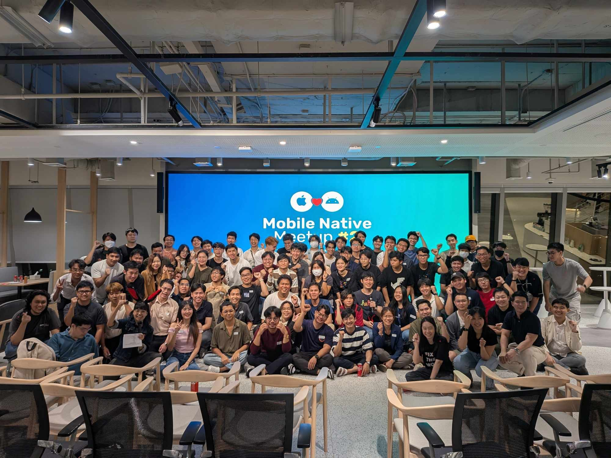

# 2024

38 blogs, 2 staff events, 1 site project, and 2 public speaking

## January

**📖 Blog**

* [สรุป Git command เผื่อได้ใช้กัน](https://www.mikkipastel.com/git-command-summary/)
* [มาทำความรู้จัก Growth Mindset กัน](https://www.mikkipastel.com/what-is-growth-mindset/)
* [Outward Mindset คืออะไร มาทำความรู้จักกัน](https://www.mikkipastel.com/what-is-outward-mindset/)

## February

**📖 Blog**

* [นั่งร่วมงาน Developer Creators and Online Communities Summit ของ Google](https://www.mikkipastel.com/developer-creators-and-online-communities-summit-google/)
* [อัพเดตเทรนคริปโตกับงาน Digital Assets Navigator ของ Bitkub](https://www.mikkipastel.com/digital-assets-navigator-bitkub/)

**🏕 Activity**

* 17 Feb. staff at COMPOSE BATTLE 2024: Compose at first sight

<figure><figcaption></figcaption></figure>

## March

**📖 Blog**

* [เล่าประสบการณ์การทำ Github Actions ของงาน Compose Battle](https://www.mikkipastel.com/github-action-android-compose-battle/)
* [รีวิว Work From Home Workspace หลังจากที่ใช้งานมาระยะหนึ่งแล้ว](https://www.mikkipastel.com/review-work-from-home-workspace/)&#x20;
* [เรียนรู้ Generative AI & ChatGPT กับอาจารย์เต้กัน](https://www.mikkipastel.com/generative-ai-chatgpt-unlock-working-with-ai/)&#x20;
* [เราใช้ iPad ทำอะไรบ้าง?](https://www.mikkipastel.com/overview-my-ipad-with-apple-pencil-application-widget/)

**🏕 Activity**

* contribute [ruam-mij-android](https://github.com/akexorcist/ruam-mij-android)

## April

**📖 Blog**

* [ทำไม เพจ MikkiPastel และเพจอื่น ๆ ถึงใช้ . ระหว่างบรรทัด มาอธิบายด้วย coding กัน](https://www.mikkipastel.com/why-facebook-page-use-dot-to-between-content-line/)&#x20;
* [รวมมิตรอัพเดตแพชครั้งใหญ่ กับ Kotlin DSL กับ toml](https://www.mikkipastel.com/migrate-project-to-kotlin-dsl-and-toml/)&#x20;
* [ปรับ mindset การทำแอพรองรับคนทุกกลุ่ม กับ "Intro to Web Accessibility" workshop](https://www.mikkipastel.com/intro-to-web-accessibility-workshop-skooldio/)

## May

**📖 Blog**

* [เพิ่ม table of content สำหรับ Ghost CMS กัน](https://www.mikkipastel.com/table-of-content-ghost-cms/)&#x20;
* [มารับความรู้ฝั่ง web3 developer กับงาน Sui Workshop](https://www.mikkipastel.com/sui-workshop-contribution-dao/)
* [iCreator Camp 2024 วันแรกกับ Storytelling & Creativity](https://www.mikkipastel.com/icreator-camp-2024-week1-storytelling-and-creativity/)&#x20;
* [เรียนรู้ Content Marketing เพื่อทำเงิน ในสัปดาห์ที่ 2 ของ iCreator Camp 2024](https://www.mikkipastel.com/icreator-camp-2024-week2-content-marketing/)

**🏕 Activity**

* 1 of 100 creators in iCreator Camp 2024

## June

**📖 Blog**

* [เรียนรู้ Design & Visual ในการสร้าง content ให้จับใจคน กับ iCreator Camp 2024 สัปดาห์ที่ 3](https://www.mikkipastel.com/icreator-camp-2024-week3-design-and-visual/)&#x20;
* [สัปดาห์การเรียนสุดท้าย ค่าย iCreator Camp 2024 กับเรื่อง Production & Platform](https://www.mikkipastel.com/creator-camp-2024-week4-production-and-platform/)&#x20;
* [รู้หรือไม่? เดี๋ยวนี้กล้องมี chip AI แยกแล้วนะ!](https://www.mikkipastel.com/icreator-camp-2024-sony-alpha-7c-ii/)&#x20;
* [วันสุดท้าย ที่เป็นแค่จุดเริ่มต้น กับค่าย iCreator Camp 2024](https://www.mikkipastel.com/icreator-camp-2024-final-day/)

## July

**📖 Blog**

* [ทำนามบัตรแจกคนทั้งโลก ในงบหลักสิบ ด้วย NFC card](https://www.mikkipastel.com/how-to-create-nfc-name-card-with-3-steps/)&#x20;
* [เป็นโควิดครั้งแรก! เป็นยังไงบ้างนะ?](https://www.mikkipastel.com/covid-19-first-time-2024/)&#x20;
* [เรียนรู้ 20 บทเรียน เมื่อต้องเป็น Speaker! จาก speaker มือโปร](https://www.mikkipastel.com/speaker-101-bitton-dao-learning-20-lesson-for-speaker/)
* [กลับมาอีกครั้งในรอบ 4 ปี กับ Kotlin Meetup 2024.1](https://www.mikkipastel.com/kotlin-meetup-2024-1-kotlin-multiplatform/)

## August

**📖 Blog**

* [อยากเทสแอพบน Foldable แต่ไม่มีเครื่องจริง ทำยังไงได้บ้าง?](https://www.mikkipastel.com/foldable-phone-emulator-firebase-android-device-streaming/)&#x20;
* [บอกต่อทริคไม่ลับ! ที่ทำให้คุณใช้ Canva Pro คุ้มขึ้น!!!](https://www.mikkipastel.com/how-to-use-canva-pro/)&#x20;
* [สอนใช้ Suno AI มาทำเพลงเองแบบง่าย ๆ ในยุค AI](https://www.mikkipastel.com/how-to-use-suno-ai-to-generate-music/)

## September

**📖 Blog**

* [รีวิวคอร์ส “Enhancing Business Performance with Generative AI” เรียนรู้แบบ zero to hero](https://www.mikkipastel.com/true-digital-academy-enhancing-business-performance-with-generative-ai/)&#x20;
* [เรียนรู้ว่า Product Management เอา AI มาใช้งานยังไง? กับงาน "Unlocking Product Insights"](https://www.mikkipastel.com/unlocking-poroduct-insights-integrating-ai-into-business-strategies-in-thailand-true-digital-academy/)&#x20;
* [แฝงตัวในดง Bitcoiner ที่งาน Thailand Bitcoin Conference 2024](https://www.mikkipastel.com/thailand-bitcoin-conference-2024/)&#x20;
* [ทำความรู้จัก Regular Expression แบบ 101 กัน](https://www.mikkipastel.com/regular-expression-regex-101/)

**🖥 Project**

* [bitcoin-odyssey](https://github.com/mikkipastel/bitcoin-odyssey): Bitcoin history website for beginner

## October

**📖 Blog**

* [จอภาพที่เกิดมาเพื่อโปรแกรมเมอร์ BenQ RD280U | World's First Programming Monitor Series](https://www.mikkipastel.com/benq-rd280u-worlds-first-programming-monitor-series/)
* [Android Developer ทำแอพให้รองรับ Accessibility ได้อย่างไรบ้าง?](https://www.mikkipastel.com/add-accessibility-in-application-for-android-developer/)
* [มางาน Bitkub Summit 2024 แล้วได้อะไร? มาดูกัน KUB](https://www.mikkipastel.com/bitkub-summit-2024/)

**🏕 Activity**

* 17 Oct. staff of Mobile Native Meetup #2&#x20;

<figure><figcaption></figcaption></figure>

## November

**📖 Blog**

* [อัพเดตเทคบ้านเขียวประจำปี กับงาน LINE Thailand Developer Conference 2024](https://www.mikkipastel.com/line-thailand-developer-conference-2024/)
* [ทดลองทำ widget gas tracker ฉบับ Jetpack Compose กันเถอะ](https://www.mikkipastel.com/create-android-widget-first-time-by-jetpack-glance/)
* [สรุปที่เรียน Prompting Profit: Building AI-Powered Business Strategies จาก AWE2024](https://www.mikkipastel.com/prompting-profit-building-ai-powered-business-strategies-awe2024/)

**🏕 Activity**

* 17 Nov. speaker of Android Bangkok Conference 2024

<figure><figcaption></figcaption></figure>

* 29 Nov. speaker of National Coding Day 2024: Workshop Day

<figure><figcaption></figcaption></figure>

## December

**📖 Blog**

* [ได้ไปฟังอะไรที่งาน National Coding Day 2024: Workshop Day บ้าง?](https://www.mikkipastel.com/national-coding-day-2024-workshop-day/)
* .

