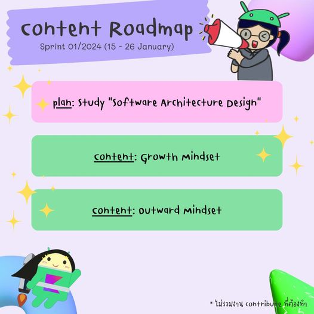

# Content Roadmap Sprint 01/2024 (15 - 26 January)

ก่อนอื่นเลย เราต้อง [#มาเรียนธอน](https://www.facebook.com/hashtag/%E0%B8%A1%E0%B8%B2%E0%B9%80%E0%B8%A3%E0%B8%B5%E0%B8%A2%E0%B8%99%E0%B8%98%E0%B8%AD%E0%B8%99?\_\_eep\_\_=6&\_\_cft\_\_\[0]=AZWHunUTXuQKOUivDsYHvoj7oP5fuhzbH3vXQT3dbSTEFvTUY6\_hBydL5SYHYyf1kXXa-i2QJdBaJ0TLL-gINZkuMQ7EZvGQiBELNME8Bt2uiAhNQdfq830GmkvWTdr8lcI&\_\_tn\_\_=\*NK-R) ให้จบภายในเดือนนี้ ซึ่ง progress ที่เราเรียน Software Architecture Design ในตอนนี้คือจบไป 80% แล้ว เหลือบทสุดท้ายแล้วแบบจริงจัง พอเราเรียนจบทั้ง 3 courses เราจะมีอะไรพิเศษปล่อยมาให้ทุกคนได้ร่วมสนุกกัน (มั้ง) 555

content ใน sprint นี้เราจะกล่าวถึง Growth Mindet กับ Outward Mindset ว่ามันคืออะไร แล้วแต่ละเรื่องเกี่ยวกับอะไรบ้าง มาติดตามกัน 

<figure><figcaption></figcaption></figure>
