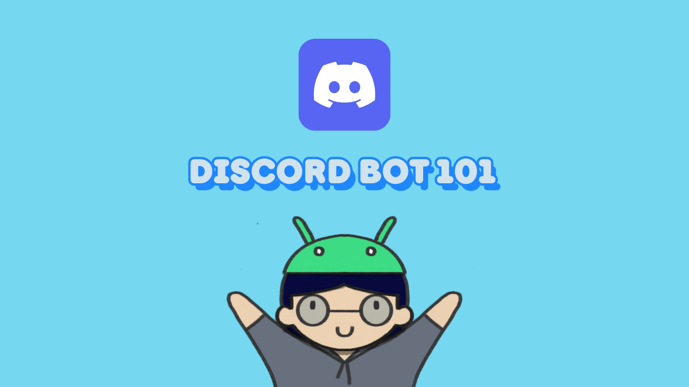

# Introduction

เป็น hands-on ของ session "**Discord Bot from my Experience: Learn by Doing**" ที่งาน "National Coding Day 2024: workshop day"

Slide: [https://docs.google.com/presentation/d/1VVan98YNYIRvQkCbw6HmZvxM-bIeojawGDnhCELMU\_o/edit?usp=sharing](https://docs.google.com/presentation/d/1VVan98YNYIRvQkCbw6HmZvxM-bIeojawGDnhCELMU_o/edit?usp=sharing)

Github: [https://github.com/mikkipastel/discord-bot-workshop](https://github.com/mikkipastel/discord-bot-workshop)

<figure><figcaption></figcaption></figure>

### Discord คืออะไร?

เป็นแอพพลิเคชั่นหนึ่งในการสื่อสารกับเพื่อน ๆ เป็นที่นิยมในวงการเกมส์ คริปโต developer และบางที่ใช้ทำงานด้วยนะ

feature หลัก ๆ ที่ใช้กันมี

* **Text Channel**: แบ่งเป็นห้องพูดคุยต่าง ๆ
* **Voice Channel**: เป็นห้องพูดคุยเสียง สามารถเปิดกล้องเพื่อ video call และ stream จอได้

<figure><figcaption></figcaption></figure>

<figure><figcaption></figcaption></figure>

* **Stage**: เหมือน Clubhouse เลย ที่มี function ยกมือขอขึ้นพูด และมี feature อื่น ๆ เหมือน Voice Channel

<figure><figcaption></figcaption></figure>

และรองรับในหลาย ๆ อุปกรณ์ ไม่ว่าจะเป็น PC, MacOS, iOS, Android

<figure><figcaption></figcaption></figure>

และเชื่อว่าหลาย ๆ คนน่าจะใช้ได้ Discord ตอนที่ MidJourney กำลังดัง ซึ่งในนั้นก็เป็น Discord bot ด้วยเช่นกัน

<figure><figcaption></figcaption></figure>

